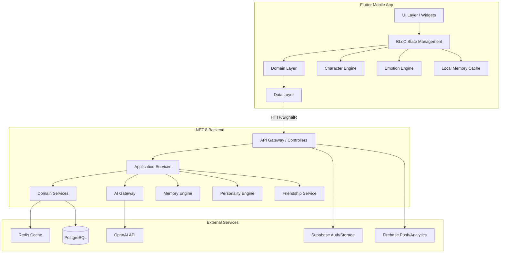
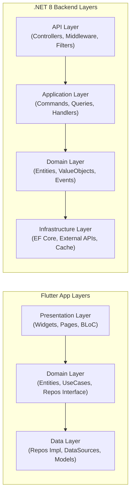
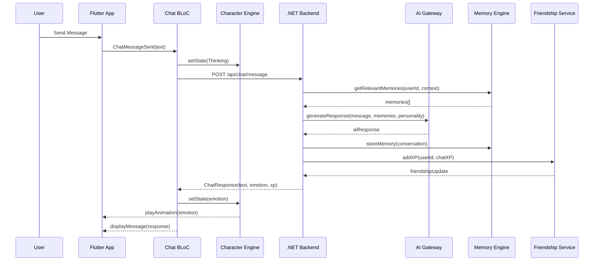
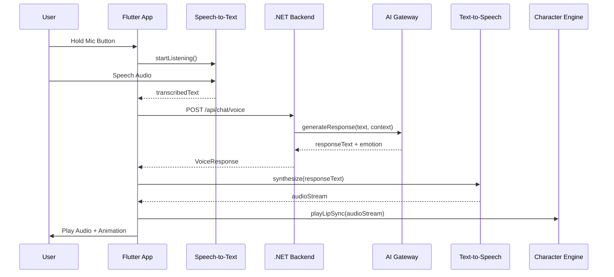
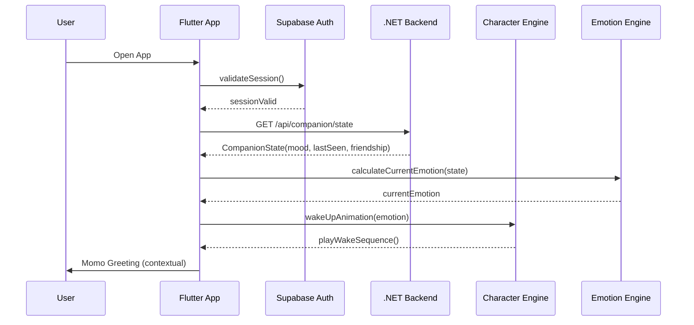

# Design Document: Momo AI Companion

## Overview

Momo AI Companion adalah sistem AI companion generasi berikutnya yang mengintegrasikan multiple engine (Character, Emotion, Memory, Personality) menjadi satu pengalaman interaktif yang terasa hidup. Arsitektur dibangun dengan pendekatan Clean Architecture di kedua sisi — Flutter (mobile) dan .NET 8 (backend) — untuk memastikan separation of concerns, testability, dan maintainability.

Sistem ini menggunakan event-driven architecture dimana setiap interaksi pengguna memicu chain of reactions: AI processing → emotion update → character animation → memory storage → friendship progression. Seluruh state disinkronkan melalui SignalR untuk real-time updates dan Redis untuk caching layer yang memastikan responsiveness.

Desain ini mencakup Phase 1 (AI Chat, Character, Voice, Friendship) sebagai MVP foundation, dengan extensibility points untuk phase berikutnya (Memory Engine, Emotion Engine, Virtual Room, dll).

## Architecture

### System Architecture




### Layered Architecture Detail



## Sequence Diagrams

### Main Chat Flow




### Voice Conversation Flow



### App Startup / Wake Sequence



## Components and Interfaces

### Component 1: AI Chat Service (Backend)

**Purpose**: Orchestrates AI conversation flow including context retrieval, response generation, and post-processing.

**Interface**:
```csharp
public interface IChatService
{
    Task<ChatResponse> ProcessMessageAsync(ChatRequest request, CancellationToken ct);
    Task<ChatResponse> ProcessVoiceMessageAsync(VoiceRequest request, CancellationToken ct);
    Task<ChatResponse> ProcessImageMessageAsync(ImageRequest request, CancellationToken ct);
    Task<ConversationHistory> GetHistoryAsync(Guid userId, int page, int pageSize, CancellationToken ct);
}
```

**Responsibilities**:
- Orchestrate message flow between Memory, AI, and Personality engines
- Manage conversation context window
- Apply personality modifiers to AI prompts
- Handle streaming responses via SignalR


### Component 2: Character Engine (Flutter)

**Purpose**: Manages Momo's visual state, animations, and transitions using Rive runtime.

**Interface**:
```dart
abstract class ICharacterEngine {
  void setState(CharacterState state);
  void playAnimation(AnimationType type, {Duration? duration});
  void setEyeTrackingTarget(Offset target);
  void startIdleLoop();
  void stopAllAnimations();
  Stream<CharacterState> get stateStream;
}
```

**Responsibilities**:
- Drive Rive animations based on emotional state
- Handle smooth transitions between animation states
- Implement eye tracking following user touch/face
- Manage idle behaviors (blink, micro-movements)
- Maintain 60 FPS rendering target

### Component 3: Emotion Engine (Flutter + Backend)

**Purpose**: Determines Momo's emotional state based on conversation context, time, and user interaction patterns.

**Interface**:
```dart
abstract class IEmotionEngine {
  EmotionState calculateEmotion(EmotionContext context);
  EmotionState blendEmotions(EmotionState current, EmotionState target, double factor);
  void updateFromConversation(ConversationEvent event);
  Stream<EmotionState> get emotionStream;
}
```

**Responsibilities**:
- Calculate emotion from AI response sentiment
- Blend between emotion states smoothly
- Factor in time-of-day and interaction patterns
- Emit emotion changes to Character Engine

### Component 4: Memory Engine (Backend)

**Purpose**: Manages long-term memory storage, retrieval, and relevance scoring for contextual conversations.

**Interface**:
```csharp
public interface IMemoryEngine
{
    Task<List<Memory>> GetRelevantMemoriesAsync(Guid userId, string context, int maxResults, CancellationToken ct);
    Task<Memory> StoreMemoryAsync(Guid userId, MemoryInput input, CancellationToken ct);
    Task<List<Memory>> SearchMemoriesAsync(Guid userId, string query, CancellationToken ct);
    Task<Timeline> GetTimelineAsync(Guid userId, DateRange range, CancellationToken ct);
    Task MarkAsFavoriteAsync(Guid userId, Guid memoryId, CancellationToken ct);
}
```

**Responsibilities**:
- Store conversation summaries as long-term memories
- Vector-based similarity search for relevant context
- Timeline reconstruction from memory entries
- Memory importance scoring and pruning


### Component 5: Personality Engine (Backend)

**Purpose**: Defines and applies Momo's personality traits to AI responses, ensuring consistent character behavior.

**Interface**:
```csharp
public interface IPersonalityEngine
{
    PersonalityProfile GetProfile(Guid userId);
    string ApplyPersonalityToPrompt(string basePrompt, PersonalityProfile profile);
    PersonalityProfile AdjustFromFeedback(PersonalityProfile current, UserFeedback feedback);
    double GetTraitValue(PersonalityProfile profile, PersonalityTrait trait);
}
```

**Responsibilities**:
- Maintain personality trait weights (humor, caring, curious, calm)
- Modify AI system prompts based on personality profile
- Adapt personality based on user interaction patterns
- Ensure consistency across conversations

### Component 6: Friendship Service (Backend)

**Purpose**: Tracks friendship progression, XP accumulation, achievements, and daily engagement mechanics.

**Interface**:
```csharp
public interface IFriendshipService
{
    Task<FriendshipState> GetStateAsync(Guid userId, CancellationToken ct);
    Task<XPResult> AddXPAsync(Guid userId, XPSource source, int amount, CancellationToken ct);
    Task<bool> ClaimDailyLoginAsync(Guid userId, CancellationToken ct);
    Task<List<Achievement>> GetAchievementsAsync(Guid userId, CancellationToken ct);
    Task<List<Achievement>> CheckNewAchievementsAsync(Guid userId, CancellationToken ct);
}
```

**Responsibilities**:
- Calculate friendship level from accumulated XP
- Grant XP for various interactions (chat, voice, daily login)
- Track and unlock achievements
- Manage streak mechanics and daily rewards

### Component 7: Virtual Room Manager (Flutter)

**Purpose**: Manages the virtual room environment where Momo lives, handling room switching and ambient effects.

**Interface**:
```dart
abstract class IVirtualRoomManager {
  Future<void> loadRoom(RoomType type);
  void setAmbientState(AmbientState state);
  void applyTimeOfDayEffect(DateTime currentTime);
  Stream<RoomState> get roomStateStream;
  List<RoomType> get availableRooms;
}
```

**Responsibilities**:
- Load and render room environments
- Apply time-of-day lighting and ambient effects
- Manage room transitions with animations
- Sync room state with friendship level (unlock rooms)


## Data Models

### ChatMessage

```csharp
public record ChatMessage
{
    public Guid Id { get; init; }
    public Guid UserId { get; init; }
    public MessageRole Role { get; init; } // User, Assistant, System
    public string Content { get; init; } = string.Empty;
    public MessageType Type { get; init; } // Text, Voice, Image
    public EmotionType? Emotion { get; init; }
    public DateTime CreatedAt { get; init; }
    public Dictionary<string, object>? Metadata { get; init; }
}
```

**Validation Rules**:
- Content must be non-empty for User messages
- Content max length: 4000 characters
- UserId must reference existing user
- CreatedAt must not be in the future

### EmotionState

```dart
class EmotionState {
  final EmotionType primary;
  final EmotionType? secondary;
  final double intensity; // 0.0 - 1.0
  final double valence; // -1.0 (negative) to 1.0 (positive)
  final double arousal; // 0.0 (calm) to 1.0 (excited)
  final DateTime timestamp;

  const EmotionState({
    required this.primary,
    this.secondary,
    required this.intensity,
    required this.valence,
    required this.arousal,
    required this.timestamp,
  });
}

enum EmotionType {
  happy,
  sad,
  angry,
  curious,
  shy,
  sleepy,
  neutral,
  excited,
}
```

**Validation Rules**:
- intensity must be between 0.0 and 1.0 inclusive
- valence must be between -1.0 and 1.0 inclusive
- arousal must be between 0.0 and 1.0 inclusive
- primary emotion is always required

### FriendshipState

```csharp
public record FriendshipState
{
    public Guid UserId { get; init; }
    public int Level { get; init; }
    public int CurrentXP { get; init; }
    public int XPToNextLevel { get; init; }
    public int TotalXP { get; init; }
    public int LoginStreak { get; init; }
    public DateTime LastLoginDate { get; init; }
    public List<string> UnlockedAchievements { get; init; } = new();
    public List<RoomType> UnlockedRooms { get; init; } = new();
}
```

**Validation Rules**:
- Level must be >= 1
- CurrentXP must be >= 0 and < XPToNextLevel
- TotalXP must be >= sum of all XP from level 1 to current
- LoginStreak must be >= 0


### Memory

```csharp
public record Memory
{
    public Guid Id { get; init; }
    public Guid UserId { get; init; }
    public string Summary { get; init; } = string.Empty;
    public string Content { get; init; } = string.Empty;
    public MemoryType Type { get; init; } // Conversation, Event, Preference, Fact
    public double ImportanceScore { get; init; } // 0.0 - 1.0
    public float[] Embedding { get; init; } = Array.Empty<float>();
    public bool IsFavorite { get; init; }
    public DateTime OccurredAt { get; init; }
    public DateTime CreatedAt { get; init; }
    public Dictionary<string, string> Tags { get; init; } = new();
}
```

**Validation Rules**:
- Summary max length: 500 characters
- Content max length: 2000 characters
- ImportanceScore must be between 0.0 and 1.0
- Embedding dimension must match configured model dimension (1536 for ada-002)

### PersonalityProfile

```csharp
public record PersonalityProfile
{
    public Guid UserId { get; init; }
    public double Humor { get; init; }    // 0.0 - 1.0
    public double Caring { get; init; }   // 0.0 - 1.0
    public double Curious { get; init; }  // 0.0 - 1.0
    public double Calm { get; init; }     // 0.0 - 1.0
    public string TonePreference { get; init; } = "balanced";
    public DateTime LastUpdated { get; init; }
}
```

**Validation Rules**:
- All trait values must be between 0.0 and 1.0
- Sum of all traits should normalize to reasonable range
- TonePreference must be one of: "playful", "supportive", "intellectual", "balanced"

## Algorithmic Pseudocode

### Chat Message Processing Algorithm

```pascal
ALGORITHM ProcessChatMessage(request)
INPUT: request containing userId, message, conversationType
OUTPUT: ChatResponse with aiReply, emotion, xpGained

BEGIN
  ASSERT request.message IS NOT EMPTY
  ASSERT request.userId IS VALID

  // Step 1: Retrieve user context
  personality ← PersonalityEngine.GetProfile(request.userId)
  friendshipState ← FriendshipService.GetState(request.userId)
  
  // Step 2: Gather relevant memories for context
  relevantMemories ← MemoryEngine.GetRelevantMemories(
    request.userId, 
    request.message, 
    maxResults: 5
  )
  
  // Step 3: Build AI prompt with personality and context
  systemPrompt ← PersonalityEngine.ApplyPersonalityToPrompt(
    BASE_SYSTEM_PROMPT, 
    personality
  )
  
  contextWindow ← BuildContextWindow(
    systemPrompt,
    relevantMemories,
    recentHistory: GetRecentMessages(request.userId, limit: 10)
  )
  
  // Step 4: Generate AI response
  aiResult ← AIGateway.GenerateResponse(contextWindow, request.message)
  
  ASSERT aiResult IS NOT NULL
  
  // Step 5: Extract emotion from response
  emotion ← EmotionEngine.AnalyzeSentiment(aiResult.text)
  
  // Step 6: Store conversation as memory
  memory ← MemoryEngine.StoreMemory(request.userId, {
    summary: SummarizeExchange(request.message, aiResult.text),
    content: aiResult.text,
    type: MemoryType.Conversation,
    importance: CalculateImportance(aiResult)
  })
  
  // Step 7: Update friendship XP
  xpResult ← FriendshipService.AddXP(
    request.userId, 
    XPSource.Chat, 
    amount: CHAT_XP_AMOUNT
  )
  
  // Step 8: Build response
  RETURN ChatResponse {
    message: aiResult.text,
    emotion: emotion,
    xpGained: xpResult.amount,
    levelUp: xpResult.leveledUp,
    newAchievements: CheckNewAchievements(request.userId)
  }
END
```


**Preconditions:**
- request.userId references an existing, authenticated user
- request.message is non-empty string with length ≤ 4000
- AI Gateway service is available and configured
- Memory Engine has initialized embedding model

**Postconditions:**
- Response contains valid AI-generated text
- Conversation stored as memory in database
- User XP updated (may trigger level-up)
- Emotion state reflects response sentiment
- No mutation of input request

**Loop Invariants:** N/A (sequential pipeline, no loops)

### Emotion Blending Algorithm

```pascal
ALGORITHM BlendEmotions(current, target, deltaTime)
INPUT: current EmotionState, target EmotionState, deltaTime in seconds
OUTPUT: blended EmotionState

BEGIN
  ASSERT current.intensity IN [0.0, 1.0]
  ASSERT target.intensity IN [0.0, 1.0]
  ASSERT deltaTime > 0

  // Smooth interpolation factor based on time
  blendSpeed ← 2.0  // emotions blend over ~0.5 seconds
  factor ← 1.0 - e^(-blendSpeed * deltaTime)
  
  ASSERT factor IN [0.0, 1.0]
  
  // Lerp each emotional dimension
  newValence ← current.valence + (target.valence - current.valence) * factor
  newArousal ← current.arousal + (target.arousal - current.arousal) * factor
  newIntensity ← current.intensity + (target.intensity - current.intensity) * factor
  
  // Determine primary emotion from blended values
  IF newIntensity < NEUTRAL_THRESHOLD THEN
    primary ← EmotionType.Neutral
  ELSE
    primary ← MapValenceArousalToEmotion(newValence, newArousal)
  END IF
  
  RETURN EmotionState {
    primary: primary,
    intensity: Clamp(newIntensity, 0.0, 1.0),
    valence: Clamp(newValence, -1.0, 1.0),
    arousal: Clamp(newArousal, 0.0, 1.0),
    timestamp: Now()
  }
END
```

**Preconditions:**
- current and target are valid EmotionState objects
- deltaTime is positive number representing elapsed seconds
- All numerical values within defined bounds

**Postconditions:**
- Result intensity is in [0.0, 1.0]
- Result valence is in [-1.0, 1.0]
- Result arousal is in [0.0, 1.0]
- Blending produces smooth transition (no abrupt changes)
- When factor = 0, result equals current; when factor = 1, result equals target

**Loop Invariants:** N/A (single computation, no loops)

### Friendship XP & Level Calculation Algorithm

```pascal
ALGORITHM CalculateLevelFromXP(totalXP)
INPUT: totalXP (non-negative integer)
OUTPUT: level, currentXP, xpToNextLevel

BEGIN
  ASSERT totalXP >= 0
  
  level ← 1
  remainingXP ← totalXP
  
  // XP curve: each level requires progressively more XP
  // Formula: XP_needed(level) = BASE_XP * level^GROWTH_FACTOR
  WHILE remainingXP >= XPRequiredForLevel(level) DO
    // Loop Invariant: sum of XP for levels 1..level-1 ≤ totalXP
    ASSERT remainingXP >= 0
    
    remainingXP ← remainingXP - XPRequiredForLevel(level)
    level ← level + 1
  END WHILE
  
  RETURN {
    level: level,
    currentXP: remainingXP,
    xpToNextLevel: XPRequiredForLevel(level)
  }
END

FUNCTION XPRequiredForLevel(level)
  BASE_XP ← 100
  GROWTH_FACTOR ← 1.5
  RETURN FLOOR(BASE_XP * level^GROWTH_FACTOR)
END FUNCTION
```

**Preconditions:**
- totalXP is non-negative integer
- BASE_XP and GROWTH_FACTOR are positive constants

**Postconditions:**
- level >= 1
- currentXP >= 0 AND currentXP < xpToNextLevel
- Sum of XPRequiredForLevel(1..level-1) + currentXP = totalXP

**Loop Invariants:**
- remainingXP >= 0 at start of each iteration
- level increases monotonically
- Sum of consumed XP + remainingXP = totalXP (constant)


### Memory Relevance Scoring Algorithm

```pascal
ALGORITHM ScoreMemoryRelevance(memory, queryContext, queryEmbedding)
INPUT: memory (Memory object), queryContext (string), queryEmbedding (float[])
OUTPUT: relevanceScore (float in [0.0, 1.0])

BEGIN
  ASSERT memory.embedding.length = queryEmbedding.length
  ASSERT memory.importanceScore IN [0.0, 1.0]
  
  // Step 1: Cosine similarity between embeddings
  semanticScore ← CosineSimilarity(memory.embedding, queryEmbedding)
  
  // Step 2: Recency decay (more recent = more relevant)
  daysSinceMemory ← (Now() - memory.occurredAt).TotalDays
  recencyScore ← e^(-DECAY_RATE * daysSinceMemory)
  
  // Step 3: Importance boost
  importanceBoost ← memory.importanceScore * IMPORTANCE_WEIGHT
  
  // Step 4: Favorite boost
  favoriteBoost ← IF memory.isFavorite THEN FAVORITE_WEIGHT ELSE 0.0
  
  // Step 5: Weighted combination
  relevanceScore ← (
    SEMANTIC_WEIGHT * semanticScore +
    RECENCY_WEIGHT * recencyScore +
    importanceBoost +
    favoriteBoost
  )
  
  RETURN Clamp(relevanceScore, 0.0, 1.0)
END
```

**Preconditions:**
- memory has valid embedding of correct dimension
- queryEmbedding is normalized vector
- All weight constants are positive and sum to ≤ 1.0

**Postconditions:**
- Result is in [0.0, 1.0]
- Higher semantic similarity → higher score
- More recent memories score higher (all else equal)
- Favorite memories get consistent boost

**Loop Invariants:** N/A (single computation)

## Key Functions with Formal Specifications

### Function 1: ProcessChatMessage()

```csharp
public async Task<ChatResponse> ProcessMessageAsync(ChatRequest request, CancellationToken ct)
```

**Preconditions:**
- `request` is non-null
- `request.UserId` references authenticated user
- `request.Message` is non-empty, length ≤ 4000
- `request.ConversationType` is valid enum value

**Postconditions:**
- Returns non-null `ChatResponse`
- `response.Message` is non-empty AI-generated text
- `response.Emotion` is valid `EmotionType`
- Conversation persisted to database
- User XP incremented

### Function 2: calculateEmotion()

```dart
EmotionState calculateEmotion(EmotionContext context)
```

**Preconditions:**
- `context` is non-null
- `context.sentimentScore` is in [-1.0, 1.0]
- `context.timeOfDay` is valid DateTime

**Postconditions:**
- Returns valid `EmotionState`
- `result.intensity` is in [0.0, 1.0]
- `result.primary` is never null
- Result accounts for time-of-day (sleepy at night)

### Function 3: GetRelevantMemories()

```csharp
public async Task<List<Memory>> GetRelevantMemoriesAsync(
    Guid userId, string context, int maxResults, CancellationToken ct)
```

**Preconditions:**
- `userId` references existing user
- `context` is non-empty string
- `maxResults` is positive integer, ≤ 20

**Postconditions:**
- Returns list with length ≤ maxResults
- Results ordered by relevance score descending
- All returned memories belong to specified user
- No duplicate memories in result set


### Function 4: AddXP()

```csharp
public async Task<XPResult> AddXPAsync(Guid userId, XPSource source, int amount, CancellationToken ct)
```

**Preconditions:**
- `userId` references existing user
- `amount` is positive integer
- `source` is valid `XPSource` enum value
- Daily XP cap not yet reached for this source

**Postconditions:**
- User's TotalXP incremented by `amount`
- Level recalculated if threshold crossed
- `result.LeveledUp` is true iff new level > previous level
- Achievements checked and awarded if criteria met
- XP transaction logged for audit

### Function 5: setState() (Character Engine)

```dart
void setState(CharacterState state)
```

**Preconditions:**
- `state` is valid `CharacterState` enum value
- Character Engine is initialized and Rive artboard loaded

**Postconditions:**
- Animation transitions smoothly from current to target state
- No frame drops during transition (maintains 60 FPS)
- State change emitted on `stateStream`
- Previous animation gracefully interrupted

## Example Usage

### Dart (Flutter) - Chat Screen BLoC

```dart
class ChatBloc extends Bloc<ChatEvent, ChatState> {
  final IChatRepository _chatRepository;
  final ICharacterEngine _characterEngine;
  final IEmotionEngine _emotionEngine;

  ChatBloc({
    required IChatRepository chatRepository,
    required ICharacterEngine characterEngine,
    required IEmotionEngine emotionEngine,
  })  : _chatRepository = chatRepository,
        _characterEngine = characterEngine,
        _emotionEngine = emotionEngine,
        super(ChatInitial()) {
    on<ChatMessageSent>(_onMessageSent);
  }

  Future<void> _onMessageSent(ChatMessageSent event, Emitter<ChatState> emit) async {
    // Show thinking state
    _characterEngine.setState(CharacterState.thinking);
    emit(ChatLoading(messages: state.messages));

    try {
      final response = await _chatRepository.sendMessage(
        ChatRequest(
          userId: event.userId,
          message: event.message,
          conversationType: ConversationType.text,
        ),
      );

      // Update emotion based on response
      final emotion = _emotionEngine.calculateEmotion(
        EmotionContext(sentimentScore: response.sentimentScore),
      );
      _characterEngine.setState(
        CharacterState.fromEmotion(emotion.primary),
      );

      // Update messages
      final updatedMessages = [
        ...state.messages,
        ChatMessageUI(role: MessageRole.user, content: event.message),
        ChatMessageUI(role: MessageRole.assistant, content: response.message),
      ];

      emit(ChatLoaded(
        messages: updatedMessages,
        xpGained: response.xpGained,
        leveledUp: response.levelUp,
      ));
    } catch (e) {
      _characterEngine.setState(CharacterState.sad);
      emit(ChatError(message: e.toString(), messages: state.messages));
    }
  }
}
```


### C# (Backend) - Chat Controller & Service

```csharp
[ApiController]
[Route("api/[controller]")]
[Authorize]
public class ChatController : ControllerBase
{
    private readonly IChatService _chatService;

    public ChatController(IChatService chatService) => _chatService = chatService;

    [HttpPost("message")]
    public async Task<ActionResult<ChatResponse>> SendMessage(
        [FromBody] ChatRequest request, CancellationToken ct)
    {
        var userId = User.GetUserId();
        request = request with { UserId = userId };
        
        var response = await _chatService.ProcessMessageAsync(request, ct);
        return Ok(response);
    }
}

public class ChatService : IChatService
{
    private readonly IAIGateway _aiGateway;
    private readonly IMemoryEngine _memoryEngine;
    private readonly IPersonalityEngine _personalityEngine;
    private readonly IFriendshipService _friendshipService;

    public async Task<ChatResponse> ProcessMessageAsync(ChatRequest request, CancellationToken ct)
    {
        // 1. Get personality and context
        var personality = _personalityEngine.GetProfile(request.UserId);
        var memories = await _memoryEngine.GetRelevantMemoriesAsync(
            request.UserId, request.Message, maxResults: 5, ct);

        // 2. Build prompt with personality
        var systemPrompt = _personalityEngine.ApplyPersonalityToPrompt(
            SystemPrompts.BaseCompanion, personality);

        // 3. Generate AI response
        var aiResult = await _aiGateway.GenerateAsync(new AIRequest
        {
            SystemPrompt = systemPrompt,
            UserMessage = request.Message,
            Context = memories.Select(m => m.Summary).ToList(),
        }, ct);

        // 4. Store memory
        await _memoryEngine.StoreMemoryAsync(request.UserId, new MemoryInput
        {
            Summary = $"User: {Truncate(request.Message, 100)} | Momo: {Truncate(aiResult.Text, 100)}",
            Content = aiResult.Text,
            Type = MemoryType.Conversation,
        }, ct);

        // 5. Award XP
        var xpResult = await _friendshipService.AddXPAsync(
            request.UserId, XPSource.Chat, amount: 10, ct);

        return new ChatResponse
        {
            Message = aiResult.Text,
            Emotion = aiResult.DetectedEmotion,
            XpGained = xpResult.Amount,
            LevelUp = xpResult.LeveledUp,
        };
    }
}
```

## Correctness Properties

The following properties must hold for all valid inputs:

### Property 1: Chat Idempotency

Sending the same message twice produces two distinct responses (non-deterministic AI), but both are valid and stored as separate memories.

### Property 2: Emotion Bounds

For all emotion states `e`: `0.0 ≤ e.intensity ≤ 1.0 ∧ -1.0 ≤ e.valence ≤ 1.0 ∧ 0.0 ≤ e.arousal ≤ 1.0`

### Property 3: XP Monotonicity

For all users, `totalXP` is monotonically non-decreasing over time. XP is never subtracted.

### Property 4: Level Consistency

For all users, `level = f(totalXP)` where `f` is the level calculation function. Level is always derivable from totalXP alone.

### Property 5: Memory Isolation

For all users A and B where A ≠ B: `GetRelevantMemories(A, _) ∩ GetRelevantMemories(B, _) = ∅`. No user can access another user's memories.

### Property 6: Friendship Progression

For all XP additions: `newLevel ≥ previousLevel`. Levels never decrease.

### Property 7: Animation State Machine

Character transitions must follow valid state machine paths. No direct jump from `Sleep` to `Laugh` without intermediate `Wake` state.

### Property 8: Personality Normalization

For all personality profiles: each trait value is in [0.0, 1.0].

### Property 9: Memory Ordering

`GetRelevantMemories` results are always ordered by relevance score descending.

### Property 10: Conversation Persistence

Every processed message results in exactly one memory entry created.


## Error Handling

### Error Scenario 1: AI Gateway Timeout

**Condition**: OpenAI API does not respond within 30 seconds
**Response**: Return cached fallback response based on personality profile. Character shows "confused" emotion.
**Recovery**: Retry with exponential backoff (max 3 attempts). If all fail, respond with personality-appropriate fallback message (e.g., "Hmm, aku lagi susah berpikir nih... coba lagi ya?")

### Error Scenario 2: Memory Engine Failure

**Condition**: PostgreSQL or embedding service unavailable during memory retrieval
**Response**: Proceed with chat without memory context. Log warning.
**Recovery**: Chat continues without personalization. Memories queued for storage when service recovers. User notified if degraded for > 5 minutes.

### Error Scenario 3: Authentication Expired

**Condition**: JWT token expired during active session
**Response**: Return 401 with refresh token hint. App silently refreshes via Supabase.
**Recovery**: Automatic token refresh using refresh token. If refresh fails, redirect to login. No data loss — pending messages queued locally.

### Error Scenario 4: Rate Limiting

**Condition**: User exceeds message rate limit (e.g., > 60 messages/minute)
**Response**: Return 429 with retry-after header. Character shows "sleepy" emotion.
**Recovery**: Client implements local rate limiting. Shows "Momo butuh istirahat sebentar" message. Cooldown timer displayed in UI.

### Error Scenario 5: Offline Mode

**Condition**: Device loses network connectivity
**Response**: Switch to offline mode. Local cache serves recent conversation history. Character shows "sleepy/waiting" state.
**Recovery**: Queue messages locally. Sync when connectivity restored. Conflict resolution: server wins for XP/level, client wins for unsent messages.

### Error Scenario 6: Animation Engine Crash

**Condition**: Rive runtime throws exception during animation
**Response**: Fallback to static character image. Log error with device info.
**Recovery**: Attempt to reload Rive artboard. If persistent, disable animations for session. Notify user that visual experience is degraded.

## Testing Strategy

### Unit Testing Approach

- **Backend (.NET)**: xUnit + Moq for service layer testing. Each service tested in isolation with mocked dependencies.
- **Flutter**: flutter_test + mocktail for BLoC and repository testing. Widget tests for UI components.
- **Key test areas**: Emotion calculation, XP/level math, memory scoring, personality prompt generation.
- **Coverage target**: 80% line coverage for domain and application layers.

### Property-Based Testing Approach

**Property Test Library**: 
- Backend: FsCheck (for .NET)
- Flutter: glados (for Dart)

**Key Properties to Test**:
1. Emotion blending always produces valid bounds
2. XP calculation is monotonic and consistent
3. Memory relevance scores are always in [0, 1]
4. Level calculation is deterministic given totalXP
5. Friendship state transitions are valid

### Integration Testing Approach

- **API Integration**: TestServer (.NET) with in-memory PostgreSQL for full request pipeline testing
- **SignalR Testing**: Integration tests for real-time message delivery
- **AI Gateway**: Contract tests with recorded responses (no live API calls in CI)
- **End-to-End**: Flutter integration_test package for critical user journeys (onboarding, chat, voice)

## Performance Considerations

- **App startup < 3 seconds**: Lazy-load non-critical engines. Character and room pre-cached. Auth check parallelized with UI init.
- **Animation 60 FPS**: Rive animations rendered on GPU. Emotion transitions use lerp (no frame-heavy particle effects). Profile on low-end devices.
- **Memory optimization**: Conversation pagination (load 20 messages at a time). Image messages use thumbnails in list, full-res on tap.
- **Battery efficiency**: Reduce animation frame rate when app backgrounded. Batch memory syncs. Disable eye tracking when screen off.
- **API latency**: Redis caching for personality profiles, friendship state, recent memories. Streaming responses via SignalR for perceived speed.
- **Offline support**: SQLite local cache for recent conversations and companion state. Queue outgoing messages with retry.

## Security Considerations

- **Authentication**: Supabase Auth with JWT. Biometric login support (FaceID/TouchID). Token refresh flow.
- **Data encryption**: TLS 1.3 in transit. AES-256 at rest for memories. Device-level encryption for local cache.
- **Privacy**: Memories are user-scoped (row-level security in PostgreSQL). No cross-user data leakage. GDPR-compliant data export/deletion.
- **API security**: Rate limiting per user. Input sanitization for prompt injection prevention. Content filtering on AI responses.
- **Biometric**: Optional biometric lock for app access. Secure enclave storage for auth tokens.

## Dependencies

| Dependency | Purpose | Layer |
|------------|---------|-------|
| Flutter 3.x | Mobile framework | Frontend |
| Dart 3.x | Programming language | Frontend |
| flutter_bloc | State management | Frontend |
| rive | Character animation | Frontend |
| supabase_flutter | Auth & storage client | Frontend |
| firebase_messaging | Push notifications | Frontend |
| speech_to_text | Voice input | Frontend |
| flutter_tts | Text-to-speech | Frontend |
| .NET 8 | Backend framework | Backend |
| Entity Framework Core | ORM | Backend |
| SignalR | Real-time communication | Backend |
| OpenAI SDK | AI integration | Backend |
| PostgreSQL 16 | Primary database | Infrastructure |
| pgvector | Vector similarity search | Infrastructure |
| Redis 7 | Caching & rate limiting | Infrastructure |
| Supabase | Auth provider & file storage | Infrastructure |
| Firebase | Push notifications & analytics | Infrastructure |
